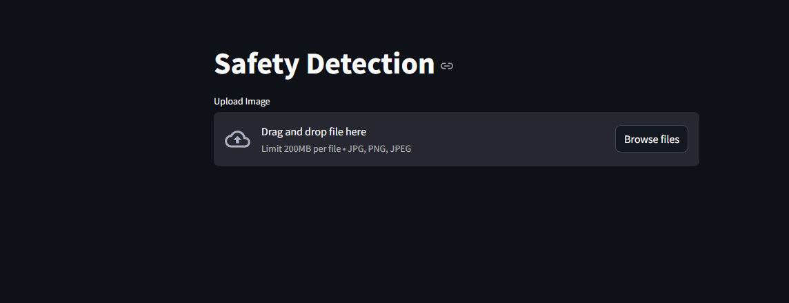
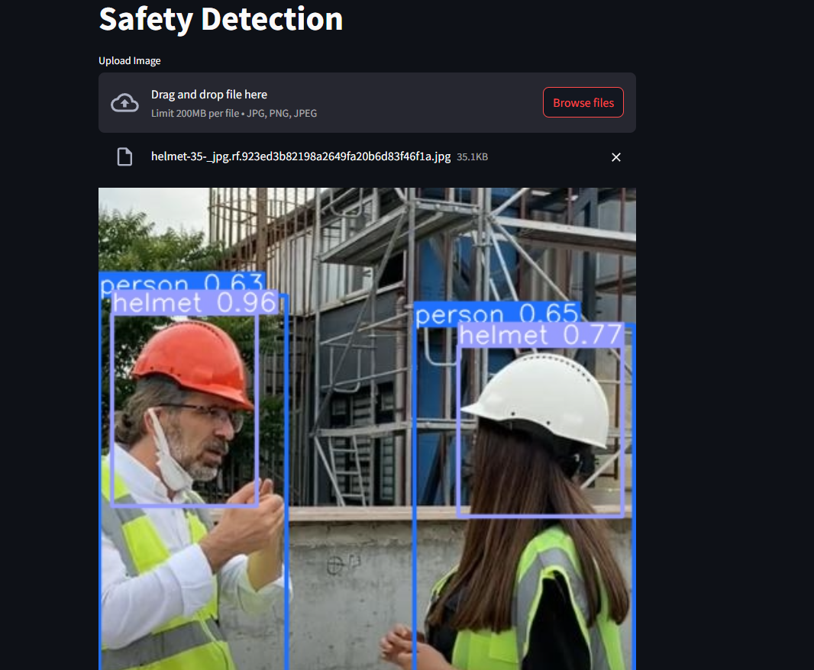

# helmet-safety-detection

## 1. Giới thiệu
Helmet safety detection là một chương tình phát hiện các nhân viên có đeo mũ bảo vệ trong công trường hay không? 

Mô hình được sử dụng ở đây là mô hình YOLOv10. Theo đó, Input và Output của chương trình là:
```
- Input: Một tấm ảnh
- Output: Tọa độ (bouding box) của các nhân viên và phần mũ bảo hiểm
```

## 2. Hướng dẫn

### 2.1 Cài đặt thư viện
- Khởi tạo môi trường qua câu lệnh `conda create [name_environment]` và khởi động môi trường `conda activate [name_environment]`
- Rồi cài đặt các package theo file requirements.txt dựa trên câu lệnh này `pip install -r requirements.txt`

### 2.2 Chạy ứng dụng trên streamlit
- Chạy câu lệnh này `streamlit run app.py`




- Chọn một ảnh bất kỳ
- Rồi nhận kết quả:


### 2.3 Huấn luyện mô hình
```Lưu ý: hãy đảm rằng máy bạn có GPU khi thực hiện việc này```

- Chạy file train qua câu lệnh sau `python src/train.py`
- Đợi cho đến khi chạy xong